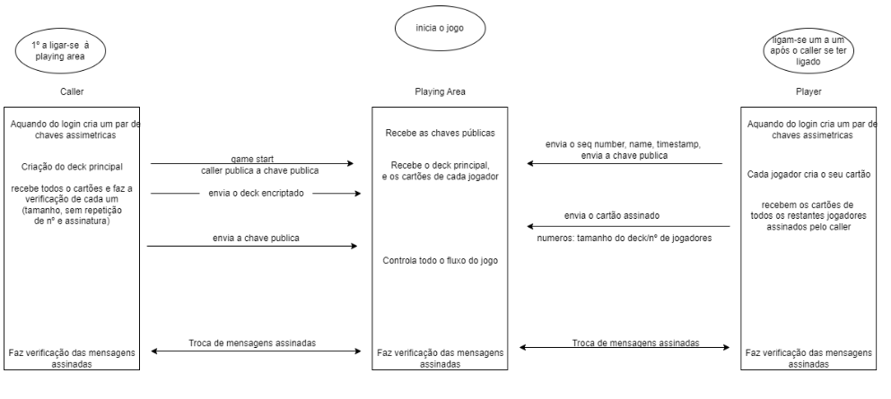

<!-- TABLE OF CONTENTS -->

  
Table of Contents

  <ol>
    <li><a href="#about-the-project">About The Project</a></li>
    <li><a href="#usage">Usage</a></li>
    <li><a href="#contact">Contact</a></li>
    <li><a href="#acknowledgments">Acknowledgments</a></li>
  </ol>

## About The Project

Project 2 - Secure Game

Descrição:

Este trabalho terá como foco a implementação de um protocolo robusto para lidar com um jogo distribuído. O jogo em estudo é o Bingo, que é um jogo de azar. A implementação consistirá na implementação de um servidor (caller), vários clientes (players) e uma área de jogo(parea) que vão comunicar através de uma rede.
Quando o programa parea.py é corrido damos início ao jogo, neste momento é vísivel no terminal da playing area uma mensagem de espera "waiting" que acontece enquanto o programa caller.py não for corrido. Quando corremos o caller.py liga-se ao jogo o jogador que vai ser responsável pelo mesmo, este jogador recebe um número de sequência igual a zero e irá criar o deck de jogo.
Em seguida, este caller fica à espera que os jogadores se liguem. Esta versão do jogo está feita para ter um caller e 4 jogadores e o jogo não começa enquanto não estiverem todos ligados.Temos também uma condição para que quando um jogador se tentar ligar ao jogo após este já ter começado envia uma mensagem para o seu terminal a informar que já não se pode ligar pois o jogo já começou.
Antes do jogo começar é vísivel na playing area a informação do caller e dos 4 jogadores, cada jogador tem um nome que é inserido por si, um número de identificação entre um e 4 e um cartão de jogo encriptado. Esta encriptação é feita por cada jogador ao seu próprio cartão com a sua chave privada e é, posteriormente, desencriptado com a sua chave pública pelo caller. A chave pública dos jogadores é também partilhada na playing área assim como os cartões desencriptados de cada jogador.
Quanto ao jogo em si aquilo que acontece é que os valores do deck do caller são percorridos 1 a 1 e comparados com os valores existentes no cartão de cada jogador. O primeiro jogador a completar uma linha no seu cartão é o vencedor.
Depois do fim do jogo é possível ver a lista de jogadores assim como as respetivas ações.
 

(<a href="#readme-top">back to top</a>)

## Delta

Nesta reformulação do projeto fizémos algumas alterações para que fosse possivel acrescentar funcionalidades no decorrer do jogo. O programa parea.py é o primeiro a ser corrido e o programa fica com a mensagem de "Começa a autenticação". Enquanto isto, começamos a correr o caller.py que se vai autenticar.
Após a ligação do Caller, este fica á espera que os jogadores se liguem e quando estiverem os quatro jogadores devidamente verificados e certificados todos enviam a sua chave publica, o seu numero, nome, timestamp tudo isto devidamente assinado por si próprio. Na playing area ficam publicadas todas as chaves públicas dos players e caller.
Quando estiverem todos os jogadores autenticados o Caller envia o deck principal encriptado para a playing area e os jogadores vão desincriptar, construir o seu cartão e enviar para a playing area também. Posteriormente, o Caller irá verificar os cartões assinados(tamanho, sem repetição de numeros e assinatura).
A partir daqui começa o jogo a decorrer...
É importante referir que nesta versão do jogo o deck é baralhado por tudos os jogadores e pelo caller para impedir batotas.
Para verificar os vencedores aquilo que é feito é verificar se cada número está presente no cartão. O card é percorrido e verifica-se se cada um dos números do deck está no card. Se o número estiver no card então a variavel cnt é incrementada, quando a variavel cnt for igual ao tamanho do card significa que todos os números foram encontrados e é retornado o número de tentativas feitas para encontrar todos os números do card.
No fim do jogo o vencedor é verificado pelo caller.

## Setup
Certifique-se de que está a correr uma versão Python 3.7 ou acima

`$ pip install -r requirements.txt`

abra N terminais (N = 2 + o nº de jogadores que quiser):

Para correr a área de jogo: `$ python3 parea.py`

Para correr o caller: `$ python3 caller.py`

Quantos quiser para correr os jogadores: `$ python3 player.py`

(<a href="#readme-top">back to top</a>)

## Autores

|NMec | Name | Email|
|-----|------|------|
|93427  | Lara Rodrigues | laravieirarodrigues@ua.pt|
|100084 | Inês Moreira |  inesfm@ua.pt |
|102737 | Ricardo Machado |  ricardo.machado@ua.pt |
|102587 | Guilherme Martins |  gcmartins@ua.pt|

(<a href="#readme-top">back to top</a>)

